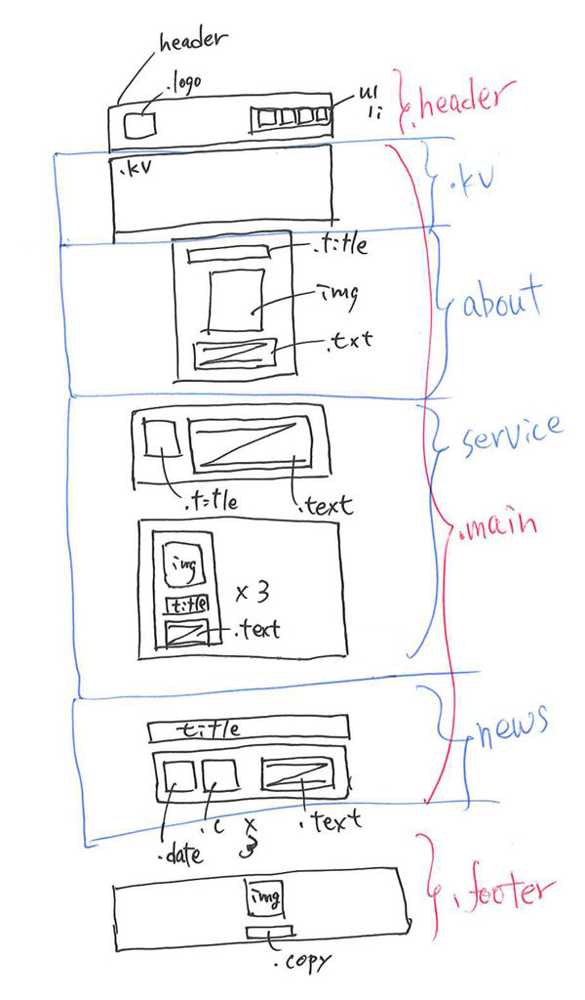

## コーディングの流れ

以下の3ステップで実装していきます。

### STEP1. デザインを見てレイアウトや構造を想像する

はじめのうちは、デザインデータにガイド線を引き、**レイアウトが目で見えるようにする**とコーディングがしやすくなります。 
以下のように手書きで書くのもおすすめです（あくまでイメージ図です）。

### STEP2. HTMLを書き出す

タグや画像ファイルを書き出します。

### STEP3. CSSを調整する

!!! note
    1ページを一気にコーディングしようとすると気持ち的に滅入ってしまうので、セクションごとに区切って進めましょう。1日1〜2セクションぐらいのペースで進めば終わります。

---

## 注意事項

### 1. 基本的にheightは指定しない

Webは、**紙媒体のデザインと違って高さが可変する性質を持っています**。

ブラウザの横幅が変わると高さが自動的に計算されるので、高さを指定してしまうと「崩れ」が生じてしまいます。

※例外はあるので絶対使ってはいけないということではありません。

### 2. widthの指定のしかたに注意

サイトはレスポンシブにつくる必要があります。 
横幅の大きいwidthは意図しない横スクロールを発生させる原因になるため、指定する箇所と単位に注意が必要です。

- レイアウトを組むための横幅の単位は基本的に`%`を使用してください 
  「ABOUT US」「MENU」「フッター」など横並びレイアウトがある箇所ではwidthに`%`を使います。

- 比較的小さい画像の横幅は`px`でOK 
  カフェサイトの見出しやロゴはどれも300px以下であり、この程度の小ささであれば`px`を使用して問題ありません。 
  一方、「ABOUT US」や「MENU」セクションにある大きい画像には`px`を使用しないでください。

- pタグなどテキスト要素にはwidthを入れないでください

### 3. 基本的にimgタグはdivタグで囲う

画像の横幅はimgタグではなく、それを囲ったdivに指定してください。 
imgタグに直接横幅を指定してしまうと、縦横比が崩れて縦や横に伸び縮みする場合があります。